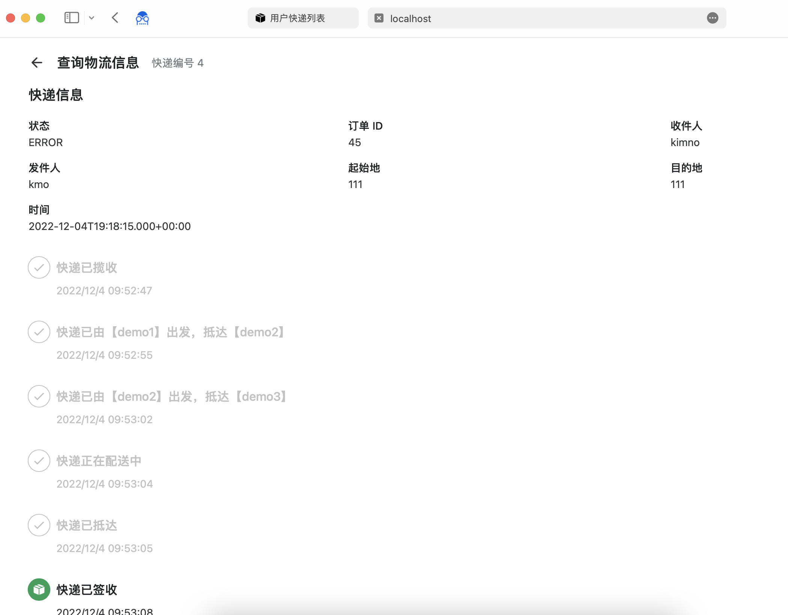
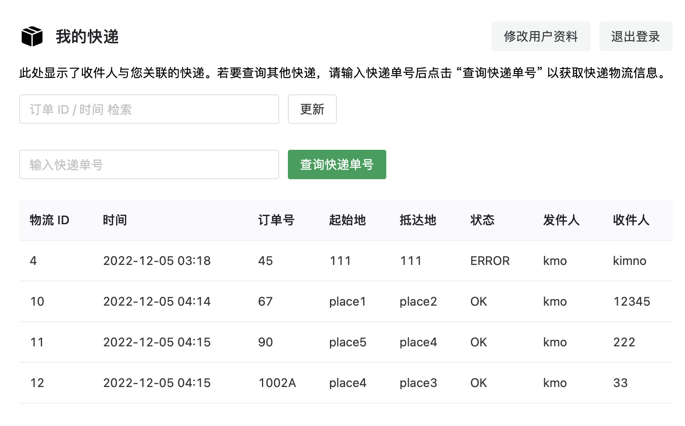
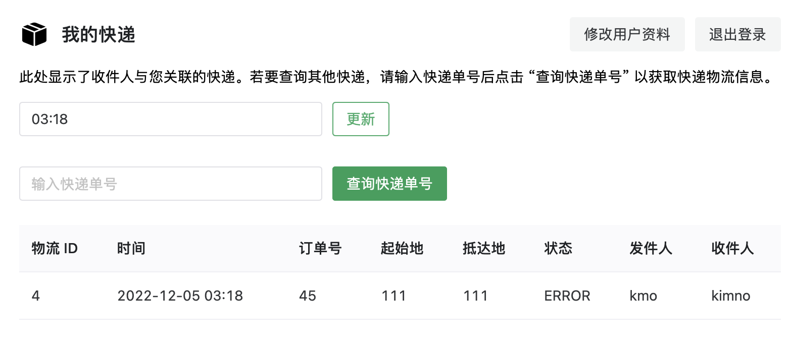
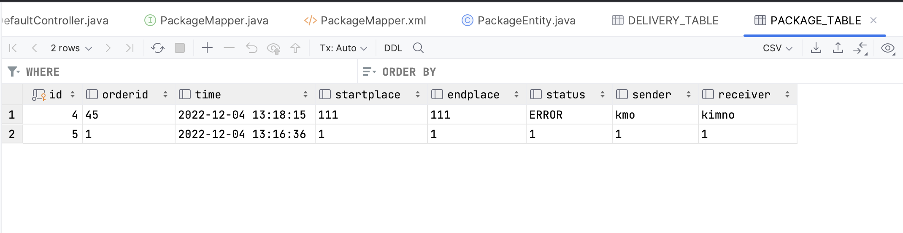
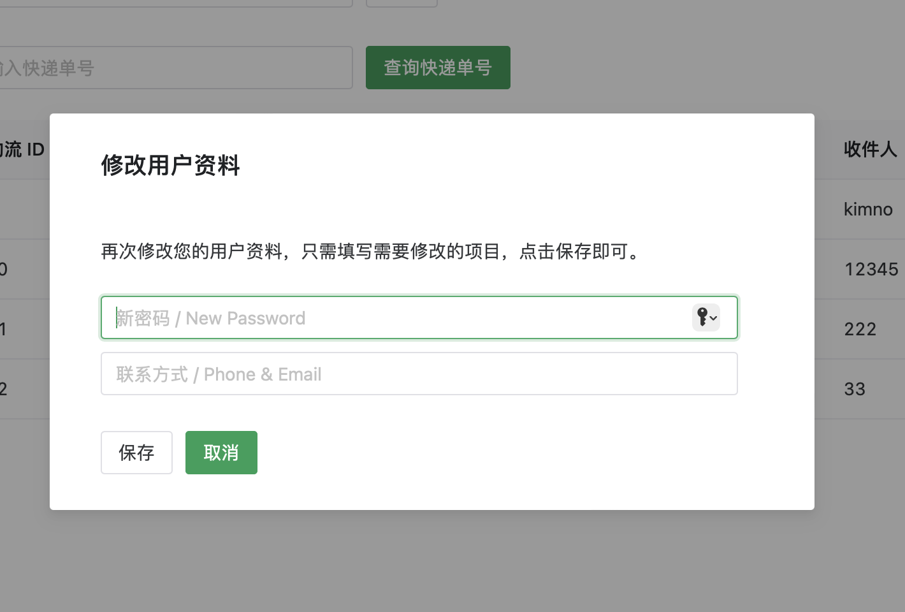

# CargoTrackSystem
大学课程设计 / Logistics Tracking System Powered by Springboot + Vue3 

题目要求：支持录入物流变化信息，可以根据时间段、订单号、物流编号等查询物流变化轨迹。

服务器： Springboot / MyBatis / Shiro / MySQL

前端页面： Vue3 / NaiveUI

* 请手动 `npm install` 载入黑洞 `node_modules`
* 前后端没整合

> SQL Dump 可能有问题，如果出问题请手动建表：新建 Schema 名称为 cargo_db 
> 
> USER_TABLE 用户表内容：uid(int) username(text) passwd(text) contact(text) type(int) 
> 
> PACKAGE_TABLE 快递表内容：id(int) orderid(text) startplace(text) endplace(text) status(text) time(datetime) sender(text) receiver(text)
> 
> DELIVERY_TABLE 物流表内容：id(int) info(text)

## 界面预览

